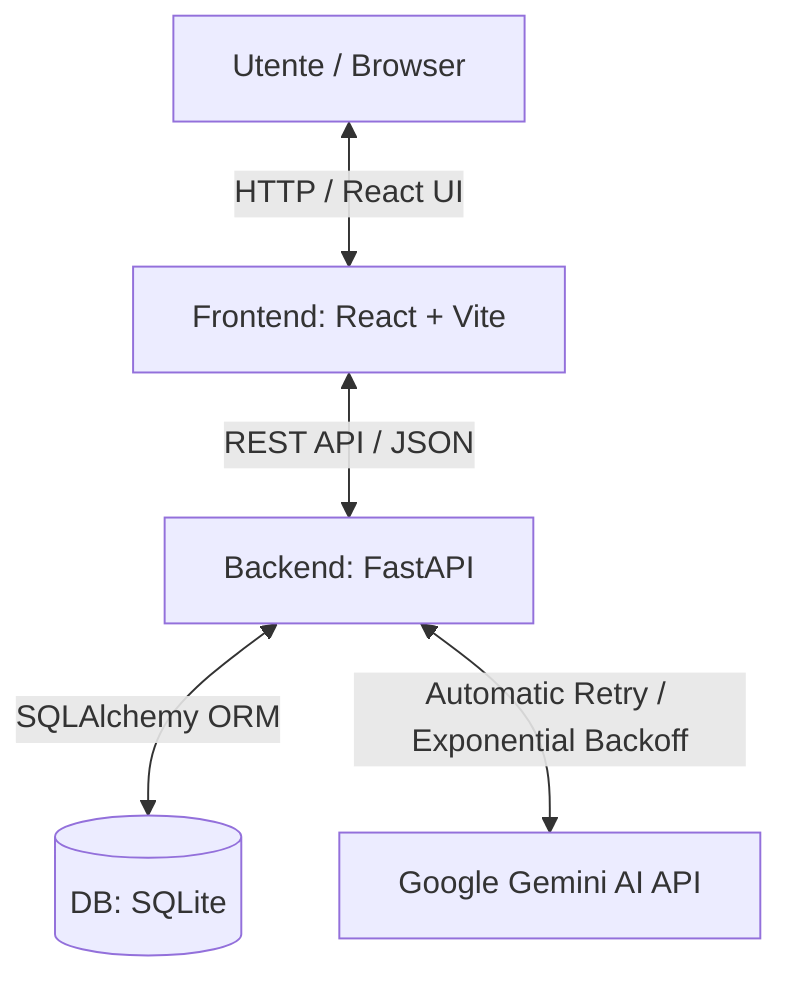

# Smart Support Inbox (AI-Powered Ticket System)

[](./README.md)

> 🇬🇧 **For the English version of the README, [click here](./README.md).**

---

Un'applicazione Full-Stack moderna per la gestione e triaging automatico dei ticket di assistenza clienti. Il sistema analizza in tempo reale le richieste degli utenti sfruttando **Google Gemini AI**, classificando l'urgenza, identificando la categoria e generando una bozza di risposta empatica e professionale.

---


```markdown
## 📁 Struttura del Progetto

```text
smart-support-inbox/
│
├── backend/
│   ├── main.py              # Applicazione FastAPI, endpoint API e logica Gemini AI con retries
│   ├── models.py            # Modelli SQLAlchemy per il database (schema tabella Ticket)
│   ├── schemas.py           # Schemi Pydantic per validazione dati e modelli di richiesta/risposta
│   ├── database.py          # Configurazione della connessione SQLite e gestione delle sessioni
│   ├── requirements.txt     # Dipendenze Python (FastAPI, Uvicorn, SQLAlchemy, google-genai)
│   └── .env.example         # Template per le variabili d'ambiente necessarie (GEMINI_API_KEY)
│
├── frontend/
│   ├── public/              # Asset statici pubblici (Vite favicon, icone)
│   ├── src/
│   │   ├── assets/          # Immagini di progetto e risorse grafiche locali - React & Vite
│   │   ├── App.jsx          # Componente React principale (interfaccia, stato e integrazione API)
│   │   ├── App.css          # Stili CSS specifici del componente
│   │   ├── main.jsx         # Punto d'ingresso dell'applicazione React
│   │   └── index.css        # Stili CSS globali e Tailwind
│   ├── index.html           # Punto di ingresso HTML (root di montaggio per React)
│   ├── package.json         # Metadati del frontend, dipendenze e script di avvio
│   ├── package-lock.json    # File di blocco delle versioni esatte delle dipendenze
│   ├── eslint.config.js     # Configurazione di ESLint per il controllo del codice
│   └── vite.config.js       # Configurazione dello strumento di build Vite
│
├── screenshots/             # Screenshot dimostrativi dell'applicazione
├── README.md                # Documentazione del progetto (Inglese)
├── README.it.md             # Documentazione del progetto (Italiano)
├── LICENSE                  # Licenza del progetto (Tutti i diritti riservati)
└── .gitignore               # Elenco dei file e cartelle ignorati da Git
```


## Architettura del Sistema




Flusso di Elaborazione
1. L'utente compila e invia un ticket dal Frontend.
2. FastAPI riceve la richiesta e invoca l'API di Google Gemini con prompt engineering strutturato (JSON).
3. L'IA restituisce un'analisi JSON deterministica (urgency, category, suggested_reply).
4. Il Backend salva il ticket con analisi e risposta dell'IA all'interno del database SQLite.
5. Il Frontend aggiorna reattivamente la dashboard con badge cromatici e la risposta dell'IA.


Tech Stack:

    Backend:
    - Framework: FastAPI (Python)
    - ORM & Database: SQLAlchemy + SQLite (Embedded)
    - Data Validation: Pydantic
    - AI Integration: Google GenAI SDK (gemini-3.5-flash-lite)
    - Web Server: Uvicorn

    Frontend:
    - Framework: React + Vite
    - HTTP Client: Axios
    - Icone & UI: Lucide React + Custom CSS (Responsive)

Funzionalità Chiave:
- Triage Automatico con IA:
    Categorizzazione istantanea (Fatturazione, Autenticazione, Bug, Generale) e assegnazione dell'urgenza (ALTA, MEDIA, BASSA).
- Bozza di Risposta Automatica:
    Generazione di una risposta empatica pronta per essere revisionata o inviata dagli operatori.
- Resilienza e Fault Tolerance:
    Sistema di retry con Exponential Backoff (incremento esponenziale del tempo di attesa tra un try e l'altro) per gestire i picchi di carico (errori 503 Service Unavailable) dell'API di Gemini, ed eventuale Graceful Degradation per gestire la situazione dopo un eventuale esito negativo dei retry, restituendo un dizionario di default ("urgency": "MEDIA", "category": "Generale").
- Documentazione API Automatica: 
    Swagger UI interattivo generato nativamente da FastAPI. Mostra inoltre le Docstring che spiegano le relative funzioni.
- Dashboard Reattiva:
    Interfaccia a due colonne (form inserimento + feed ticket con aggiornamento dinamico).


## Anteprima e documentazione API

### Dashboard React e analisi con IA


### Documentazione interattiva delle API (FastAPI Swagger UI)


Guida all'Installazione ed Esecuzione

Prerequisiti:
- Python 3.10+
- Node.js v18+
- Chiave API di Google AI Studio (ottenibile gratuitamente)
<br><br>

1. Configurazione Backend
    1. Posizionati nella cartella del backend:
        `cd backend`
    2. Crea e attiva l'ambiente virtuale Python:
        `python -m venv venv`
        Su Windows: `.\venv\Scripts\activate`
        Su Mac/Linux: `source venv/bin/activate`
    3. Installa le dipendenze:
        `python -m pip install fastapi uvicorn sqlalchemy pydantic python-dotenv google-genai`
    4. Crea un file .env nella cartella backend:
        `GEMINI_API_KEY=la_tua_chiave_api_qui`
    5. Avvia il server FastAPI:
        `python -m uvicorn main:app --reload`

    Il backend sarà attivo su: http://127.0.0.1:8000<br>
    Documentazione Swagger UI: http://127.0.0.1:8000/docs

<br>
2. Configurazione Frontend
    1. Apri un nuovo terminale e posizionati nella cartella frontend:
        `cd frontend`
    2. Installa le dipendenze Node.js:
        `npm install`
    3. Avvia il server di sviluppo React:
        `npm run dev`

L'applicazione sarà visibile su: http://localhost:5173
<br><br>

Endpoint API Principali
Metodo,Endpoint,Descrizione
GET,/,Health check del server API
POST,/tickets/,"Crea un nuovo ticket, lo analizza con Gemini e lo salva nel DB"
GET,/tickets/,Recupera l'elenco di tutti i ticket in ordine cronologico


Sviluppi Futuri (Roadmap)
- Filtri avanzati per Urgenza e Categoria nella dashboard.
- Gestione dello stato del ticket (Aperto / In Lavorazione / Chiuso).
- Autenticazione utenti (Ruolo Cliente vs Ruolo Operatore).


Avviare nuovamente il progetto se già installato in precedenza:

AVVIO BACKEND:
1. Entra nella cartella del backend:
    `cd backend`
2. Attiva l'ambiente virtuale Python:
    `.\venv\Scripts\activate`
3. Avvia il server Uvicorn:
    `python -m uvicorn main:app --reload`

AVVIO FRONTEND:
1. Entra nella cartella del frontend:
    `cd frontend`
2. Avvia il server di sviluppo Vite:
    `npm run dev`

Per provare l'applicazione apri quindi il tuo browser web e naviga su:
`http://localhost:5173`