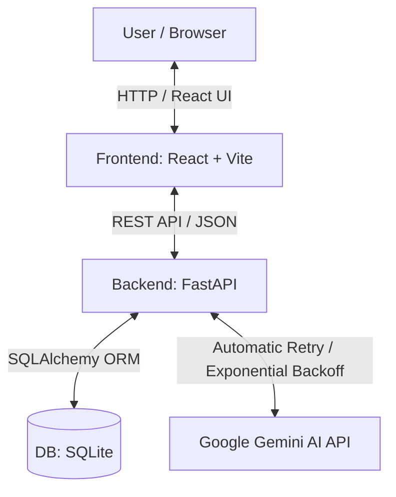
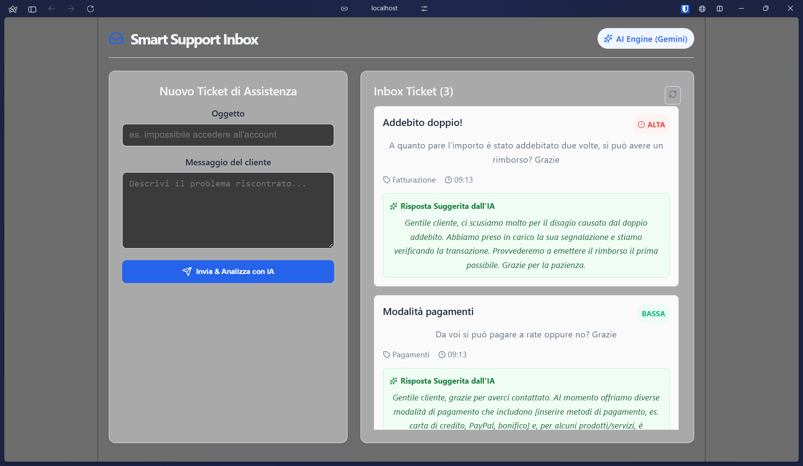
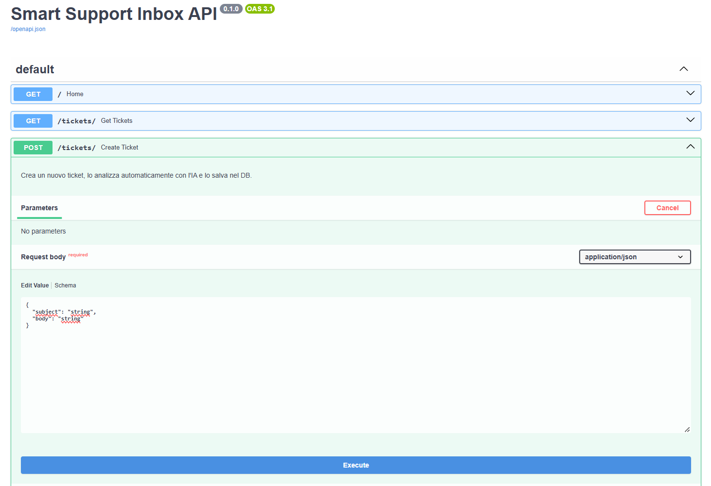

# Smart Support Inbox (AI-Powered Ticket System)

[](./README.it.md)

> 🇮🇹 **Per la versione in italiano del README, [clicca qui](./README.it.md).**

---

A modern full-stack application for the management and automated triaging of customer support tickets. The system analyzes user requests in real-time using **Google Gemini AI**, classifying urgency, identifying the category, and generating an empathetic, professional response.

---


## 📁 Project Structure

```text
smart-support-inbox/
│
├── backend/
│   ├── main.py              # FastAPI app, API routes, and Gemini AI integration with retry logic
│   ├── models.py            # SQLAlchemy database models (Ticket table schema)
│   ├── schemas.py           # Pydantic schemas for data validation and API request/response models
│   ├── database.py          # SQLite connection setup and session management
│   ├── requirements.txt     # Python dependencies (FastAPI, Uvicorn, SQLAlchemy, google-genai)
│   └── .env.example         # Template for required environment variables (GEMINI_API_KEY)
│
├── frontend/
│   ├── public/              # Static public assets (Vite favicons, icons)
│   ├── src/
│   │   ├── assets/          # Project images and local visual assets - React & Vite
│   │   ├── App.jsx          # Main React component (UI, state, and API integration)
│   │   ├── App.css          # Component specific CSS styles
│   │   ├── main.jsx         # React application entry point
│   │   └── index.css        # Global CSS styles and Tailwind setup
│   ├── index.html           # HTML entry point (mounting root for React)
│   ├── package.json         # Frontend metadata, dependencies, and execution scripts
│   ├── package-lock.json    # Exact dependency tree lockfile
│   ├── eslint.config.js     # ESLint code quality and linting configuration
│   └── vite.config.js       # Vite build tool configuration
│
├── screenshots/             # Application screenshots for demonstration
├── README.md                # Project documentation (English)
├── README.it.md             # Project documentation (Italian)
├── LICENSE                  # Project license (All Rights Reserved)
└── .gitignore               # List of files and directories ignored by Git
```


## System Architecture




Processing Workflow
1. The user fills out and submits a ticket via the frontend.
2. FastAPI receives the request and calls the Google Gemini API using structured prompt engineering (JSON).
3. The AI ​​returns a deterministic JSON analysis (urgency, category, suggested_reply).
4. The backend saves the ticket, along with the AI's analysis and response, to the SQLite database.
5. The frontend reactively updates the dashboard with color-coded badges and the AI's response.

Tech Stack:

    Backend:
    - Framework: FastAPI (Python)
    - ORM & Database: SQLAlchemy + SQLite (Embedded)
    - Data Validation: Pydantic
    - AI Integration: Google GenAI SDK (gemini-3.5-flash-lite)
    - Web Server: Uvicorn

    Frontend:
    - Framework: React + Vite
    - HTTP Client: Axios
    - Icone & UI: Lucide React + Custom CSS (Responsive)

Key Features:
- Automated AI Triage:
Instant categorization (Billing, Authentication, Bug, General) and urgency assignment (HIGH, MEDIUM, LOW).
- Automated Draft Response:
Generation of an empathetic response ready for review or dispatch by agents.
- Resilience and Fault Tolerance:
Retry system with Exponential Backoff (exponentially increasing wait times between attempts) to handle load spikes (503 Service Unavailable errors) from the Gemini API, plus graceful degradation to handle scenarios where retries fail, returning a default dictionary (`"urgency": "MEDIUM"`, `"category": "General"`).
- Automated API Documentation:
Interactive Swagger UI generated natively by FastAPI; also displays docstrings explaining the respective functions.
- Reactive Dashboard:
Two-column interface (input form + dynamically updating ticket feed).


## Preview & API Documentation

### React Dashboard & AI Analysis


### Interactive API Documentation (FastAPI Swagger UI)



Installation and Execution Guide

Prerequisites:
- Python 3.10+
- Node.js v18+
- Google AI Studio API key (available for free)
<br><br>

1. Backend Setup
    1. Navigate to the backend folder:
    `cd backend`
    2. Create and activate the Python virtual environment:
    `python -m venv venv`
    On Windows: `.\venv\Scripts\activate`
    On Mac/Linux: `source venv/bin/activate`
    3. Install dependencies:
    `python -m pip install fastapi uvicorn sqlalchemy pydantic python-dotenv google-genai`
    4. Create a .env file in the backend folder:
    `GEMINI_API_KEY=your_api_key_here`
    5. Start the FastAPI server:
    `python -m uvicorn main:app --reload`

    The backend will be running at: http://127.0.0.1:8000<br>
    Swagger UI documentation: http://127.0.0.1:8000/docs

<br>
2. Frontend Setup
    1. Open a new terminal and navigate to the frontend folder:
    `cd frontend`
    2. Install Node.js dependencies:
    `npm install`
    3. Start the React development server:
    `npm run dev`

    The application will be visible at: http://localhost:5173
<br><br>

Key API Endpoints<br>
Method, Endpoint, Description<br>
GET,/,API server health check<br>
POST,/tickets/,"It creates a new ticket, analyzes it with Gemini, and saves it to the DB"<br>
GET,/tickets/,Retrieve the list of all tickets in chronological order<br>


Future Developments (Roadmap)
- Advanced filters for Urgency and Category on the dashboard.
- Ticket status management (Open / In Progress / Closed).
- User authentication (Customer role vs. Operator role).


Restart the project if it was previously installed:

STARTING THE BACKEND:
1. Enter the backend folder:
    `cd backend`
2. Activate the Python virtual environment:
    `.\venv\Scripts\activate`
3. Start the Uvicorn server:
    `python -m uvicorn main:app --reload`

STARTING THE FRONTEND:
1. Enter the frontend folder:
    `cd frontend`
2. Start the Vite development server:
    `npm run dev`

To try out the application, open your web browser and navigate to:
`http://localhost:5173`